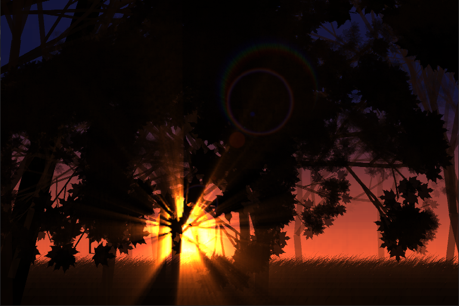

# ForestWalk
A hobby project that lets us touch grass in a virtual forest with real-time grass and tree swaying.


## Screenshot



## Requirements
`-` MSVC compiler

`-` OpenGL

`-` SFML (used version = 2.6.1)

`-` GLEW (used version = 2.1.0)

`-` GLM


## Installation
`1.` Clone the respository

`2.` Install the libraries in the lib directory

`3.` Configure the cmake for the project
```bash
mkdir build
cd build
cmake ..
cd ..
```

`4.` Build the project files

### If using VSCode
Run the project after setting the "commmand" in tasks.json file and skip the rest of the steps
```json
"command": "path/to/MSBuild",
```

### Else
```bash
cmake --build build --target ALL_BUILD --config Debug
<path/to/compiler> <path/to/.sln>
```

`5.` Copy the .dlls(if necessary) to the executable directory

`6.` Execute the project